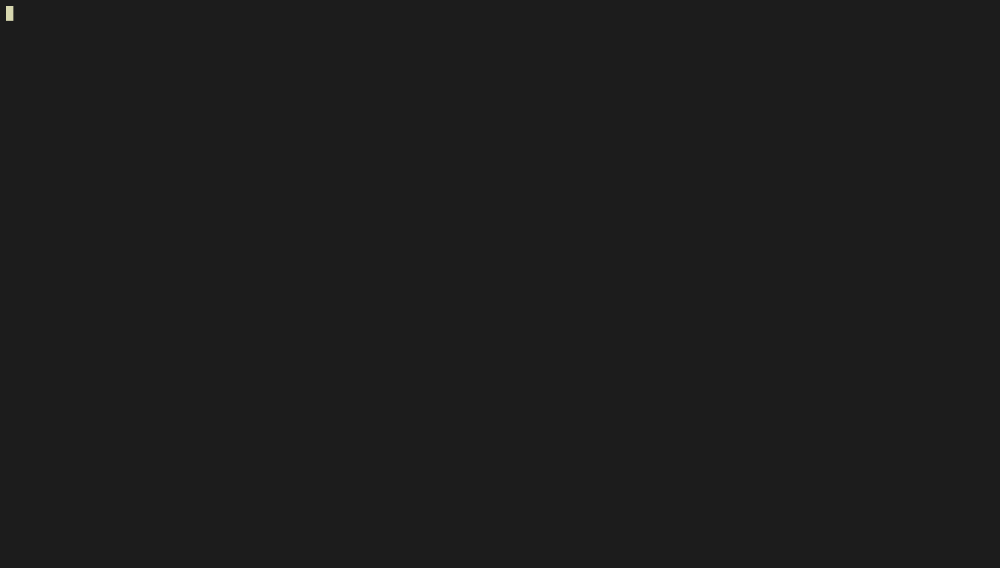

**weking** is open source malicious url checker tool. I developed with 'Python'.

[Weking Tool](https://github.com/aslanemre/weking)


# [](#header-1)Usage

source_url is malicious sites list. you can change it.
'pyhon3 weking.py'


### [](#header-3)Code

```python
def control():
    url = str(input("[ ? ] Entry a domain : "))
    print("")
    source = open("source.txt", "r")
    bads = source.read()
    source.close()
    if str(url) in str(bads):
        print("[ ! ] Bad url detected." )
    else:
        print("[ + ] Its not bad url." )
control()
```



